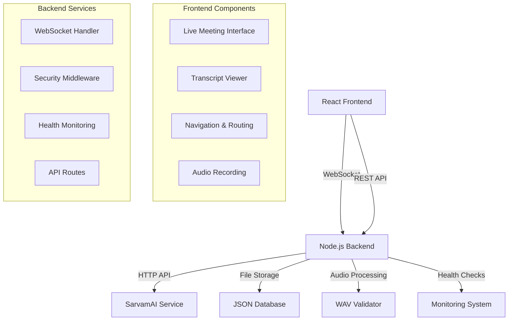

# Granola Clone - Complete Application

> Professional-grade Hindi speech-to-text transcription application with real-time processing, modern React frontend, and enterprise Node.js backend

[](https://reactjs.org/)
[](https://nodejs.org/)
[](https://expressjs.com/)
[](https://developer.mozilla.org/en-US/docs/Web/API/WebSockets_API)
[](#license)

## 🎯 Overview

Granola Clone is a comprehensive speech-to-text transcription application designed for Hindi language processing. It combines a modern React frontend with an enterprise-grade Node.js backend to deliver real-time audio transcription capabilities through WebSocket connections and SarvamAI integration.

## ✨ Key Features

### 🎤 **Real-time Speech Processing**

- **Live Audio Recording**: Professional Web Audio API integration
- **Instant Transcription**: Real-time Hindi speech-to-text conversion
- **WebSocket Communication**: Low-latency bidirectional communication
- **Advanced Audio Processing**: Custom WAV encoding optimized for speech recognition

### 🎨 **Modern User Experience**

- **React 19 Frontend**: Latest React features with concurrent rendering
- **Responsive Design**: Mobile-first approach with desktop optimization
- **Real-time Feedback**: Live transcription display with status indicators
- **Professional UI/UX**: Clean, intuitive interface design

### 🔒 **Enterprise Security**

- **Comprehensive Security Stack**: Multi-layer security middleware
- **Rate Limiting**: Protection against abuse with configurable limits
- **Input Validation**: Joi-based request validation and sanitization
- **CORS Protection**: Secure cross-origin resource sharing

### 📊 **Monitoring & Health**

- **Health Monitoring**: Comprehensive system health checks
- **Performance Metrics**: Real-time monitoring and analytics
- **Error Tracking**: Professional error handling and logging
- **API Status Monitoring**: Service connectivity and health verification

## 🏗️ Architecture



## 🚀 Quick Start

### Prerequisites

- **Node.js** >= 16.0.0
- **npm** >= 8.0.0 or **yarn** >= 1.22.0
- **SarvamAI API Key** (for production transcription)
- Modern web browser with Web Audio API support

### Installation

```bash
# Clone the complete project
git clone https://github.com/your-username/granola-clone.git
cd granola-clone

# Install and start backend
cd granola-clone-backend
npm install
cp .env.example .env
# Configure your .env file with SarvamAI API key
npm run dev

# In a new terminal, install and start frontend
cd ../granola-clone
npm install
npm start
```

### Quick Setup Script

```bash
#!/bin/bash
# setup.sh - Quick project setup script

echo "🚀 Setting up Granola Clone Application..."

# Backend Setup
echo "📦 Setting up backend..."
cd granola-clone-backend
npm install
if [ ! -f .env ]; then
    cp .env.example .env
    echo "⚠️  Please configure your .env file with SarvamAI API key"
fi

# Frontend Setup
echo "🎨 Setting up frontend..."
cd ../granola-clone
npm install

echo "✅ Setup complete! Run the following commands:"
echo "Backend: cd granola-clone-backend && npm run dev"
echo "Frontend: cd granola-clone && npm start"
```

## 📁 Project Structure

```
granola-clone/
├── granola-clone/                    # React Frontend Application
│   ├── public/                       # Static assets and HTML template
│   ├── src/
│   │   ├── components/              # Reusable UI components
│   │   │   ├── MeetingCard.js       # Meeting display component
│   │   │   ├── MicButton.js         # Microphone control
│   │   │   ├── Navbar.js            # Navigation component
│   │   │   └── TranscriptViewer.js  # Real-time transcript display
│   │   ├── context/                 # React Context providers
│   │   │   └── TranscriptContext.js # Global state management
│   │   ├── pages/                   # Application pages/routes
│   │   │   ├── Home.js              # Dashboard and meeting list
│   │   │   ├── LiveMeeting.js       # Live recording interface
│   │   │   └── Transcript.js        # Individual transcript view
│   │   ├── utils/                   # Utility functions
│   │   │   └── wavEncoder.js        # Advanced WAV encoding
│   │   └── __mocks__/               # Mock data for development
│   ├── build/                       # Production build output
│   └── package.json                 # Frontend dependencies
├── granola-clone-backend/           # Node.js Backend Application
│   ├── config/
│   │   └── environment.js           # Environment configuration
│   ├── middleware/
│   │   ├── security.js              # Security middleware stack
│   │   └── validation.js            # Request validation
│   ├── routes/
│   │   ├── health.js                # Health monitoring endpoints
│   │   └── transcripts.js           # Transcript CRUD operations
│   ├── utils/
│   │   └── wavValidator.js          # WAV file processing
│   ├── ws/
│   │   └── sttHandler.js            # WebSocket speech-to-text handler
│   ├── data/                        # JSON database storage
│   ├── logs/                        # Application logs
│   ├── temp/                        # Temporary file processing
│   └── package.json                 # Backend dependencies
├── docs/                            # Documentation files
├── scripts/                         # Utility scripts
├── docker-compose.yml               # Docker orchestration
├── .gitignore                       # Git ignore patterns
├── LICENSE                          # MIT License
└── README.md                        # This file
```

## 🔧 Configuration

### Environment Configuration

#### Backend (.env)

```env
# Server Configuration
PORT=5000
HOST=localhost
NODE_ENV=development

# SarvamAI API Configuration
SARVAM_API_KEY=your_sarvam_api_key_here
SARVAM_API_URL=https://api.sarvam.ai

# Security Configuration
CORS_ORIGIN=http://localhost:3000
RATE_LIMIT_MAX=100
MAX_REQUEST_SIZE=50mb

# WebSocket Configuration
WS_PATH=/ws/stt
WS_MAX_CONNECTIONS=100

# Logging Configuration
LOG_LEVEL=info
```

#### Frontend (.env)

```env
# API Configuration
REACT_APP_API_URL=http://localhost:5000
REACT_APP_WS_URL=ws://localhost:5000/ws/stt

# Feature Flags
REACT_APP_ENABLE_MOCK_MODE=false
REACT_APP_DEBUG_MODE=true

# Performance
REACT_APP_MAX_RECORDING_DURATION=300
REACT_APP_AUDIO_SAMPLE_RATE=16000
```

## 🎯 API Documentation

### REST API Endpoints

#### Health & Monitoring

```bash
GET /health              # Basic health check
GET /health/detailed     # Comprehensive health check
GET /status             # System status information
GET /ready              # Readiness check for load balancers
GET /live               # Liveness check for orchestration
```

#### Transcript Management

```bash
GET    /api/transcripts     # Get all transcripts
GET    /api/transcripts/:id # Get specific transcript
POST   /api/transcripts     # Create new transcript
PUT    /api/transcripts/:id # Update transcript
DELETE /api/transcripts/:id # Delete transcript
```

### WebSocket API

#### Connection

```javascript
const ws = new WebSocket("ws://localhost:5000/ws/stt");
```

#### Audio Message Format

```json
{
  "audio": "base64_encoded_wav_data",
  "mimeType": "audio/wav",
  "timestamp": "2025-09-28T10:00:00.000Z",
  "metadata": {
    "duration": 5.2,
    "sampleRate": 16000,
    "channels": 1
  }
}
```

#### Transcription Response

```json
{
  "transcript": "नमस्ते, आज का मीटिंग शुरू हो रहा है।",
  "timestamp": "2025-09-28T10:00:01.000Z",
  "processingTime": 1500,
  "confidence": 0.95
}
```

## 🔒 Security Features

### Backend Security

- **Helmet Security Headers**: CSP, HSTS, X-Frame-Options protection
- **Rate Limiting**: Multi-tier protection (100 req/15min general, 10 WS/min)
- **Input Validation**: Joi-based schema validation for all endpoints
- **CORS Protection**: Configurable origin validation
- **Request Sanitization**: XSS and injection attack prevention

### Frontend Security

- **Content Security Policy**: Strict CSP headers from backend
- **Secure WebSocket**: WSS for production environments
- **Input Sanitization**: Client-side input validation and encoding
- **Error Boundary**: Graceful error handling and recovery

## 📊 Monitoring & Analytics

### Health Monitoring

```bash
# Check application health
curl http://localhost:5000/health

# Detailed system health
curl http://localhost:5000/health/detailed

# System status and metrics
curl http://localhost:5000/status
```

### Performance Metrics

- **Response Times**: API endpoint performance tracking
- **Memory Usage**: Real-time memory consumption monitoring
- **WebSocket Connections**: Active connection tracking
- **Audio Processing**: Transcription performance metrics

### Logging

- **Request Logging**: Comprehensive HTTP request logging
- **Error Tracking**: Detailed error logging with stack traces
- **Security Events**: Rate limiting and security violation logging
- **Performance Logging**: Response times and resource usage

## 🚀 Deployment

### Development Deployment

```bash
# Start both services in development mode
npm run dev:all

# Or start individually
# Backend
cd granola-clone-backend && npm run dev

# Frontend
cd granola-clone && npm start
```

### Production Deployment

#### Docker Deployment

```yaml
# docker-compose.yml
version: "3.8"
services:
  backend:
    build: ./granola-clone-backend
    ports:
      - "5000:5000"
    environment:
      - NODE_ENV=production
      - SARVAM_API_KEY=${SARVAM_API_KEY}
    healthcheck:
      test: ["CMD", "curl", "-f", "http://localhost:5000/health"]
      interval: 30s
      timeout: 10s
      retries: 3

  frontend:
    build: ./granola-clone
    ports:
      - "3000:80"
    depends_on:
      - backend
```

```bash
# Deploy with Docker Compose
docker-compose up -d

# Check service health
docker-compose ps
```

#### Manual Production Deployment

```bash
# Backend production build
cd granola-clone-backend
npm ci --only=production
NODE_ENV=production npm start

# Frontend production build
cd granola-clone
npm run build
# Serve build folder with nginx or static hosting
```

### Cloud Deployment Options

- **AWS**: EC2, ECS, or Lambda deployment
- **Google Cloud**: App Engine or Cloud Run
- **Azure**: App Service or Container Instances
- **Heroku**: Web dyno deployment
- **DigitalOcean**: Droplet or App Platform
- **Vercel/Netlify**: Frontend static hosting

## 🧪 Testing

### Running Tests

```bash
# Backend tests
cd granola-clone-backend
npm test
npm run security:audit

# Frontend tests
cd granola-clone
npm test
npm run test:coverage

# Integration tests
npm run test:integration
```

### Test Coverage

- **Unit Tests**: Individual component and function testing
- **Integration Tests**: API endpoint and WebSocket testing
- **E2E Tests**: Complete user workflow testing
- **Security Tests**: Vulnerability and penetration testing
- **Performance Tests**: Load and stress testing

## 🛠️ Development

### Development Workflow

```bash
# Start development environment
./scripts/dev-setup.sh

# Code formatting and linting
npm run format
npm run lint

# Security audit
npm run security:check

# Build for production
npm run build:all
```

### Code Quality

- **ESLint**: Comprehensive JavaScript/React linting
- **Prettier**: Consistent code formatting
- **JSDoc**: Professional code documentation
- **Husky**: Pre-commit hooks for quality assurance
- **Jest**: Unit and integration testing

## 📈 Performance Optimization

### Frontend Performance

- **Code Splitting**: Automatic route-based code splitting
- **Lazy Loading**: Component lazy loading for faster initial load
- **Memoization**: React.memo and useMemo optimizations
- **Bundle Analysis**: Built-in bundle size analysis and optimization

### Backend Performance

- **Response Compression**: Gzip compression for all responses
- **Connection Pooling**: Efficient HTTP and WebSocket connection management
- **Memory Management**: Automatic garbage collection optimization
- **Caching**: Redis integration for session and response caching

### WebSocket Optimization

- **Connection Pooling**: Efficient WebSocket connection management
- **Message Queuing**: Smart queuing for concurrent audio processing
- **Buffer Management**: Memory-efficient audio data handling
- **Heartbeat Monitoring**: Connection health and timeout management

## 🔧 Troubleshooting

### Common Issues

#### 1. WebSocket Connection Issues

```bash
# Check backend health
curl http://localhost:5000/health

# Test WebSocket connection
wscat -c ws://localhost:5000/ws/stt

# Verify CORS configuration
curl -H "Origin: http://localhost:3000" http://localhost:5000/api/transcripts
```

#### 2. Audio Recording Problems

```bash
# Check browser compatibility
# Open browser console and verify:
# - navigator.mediaDevices.getUserMedia exists
# - Web Audio API support
# - Secure context (HTTPS in production)
```

#### 3. API Integration Issues

```bash
# Test SarvamAI API key
cd granola-clone-backend
node test-api.js

# Check API connectivity
curl -H "api-subscription-key: YOUR_KEY" https://api.sarvam.ai/speech-to-text
```

#### 4. Build and Deployment Issues

```bash
# Clear dependencies and reinstall
rm -rf node_modules package-lock.json
npm install

# Check Node.js version
node --version  # Should be >= 16.0.0

# Verify environment variables
npm run env:check
```

### Debug Mode

```bash
# Enable debug logging
DEBUG=* npm run dev

# Backend debug mode
cd granola-clone-backend
LOG_LEVEL=debug npm run dev

# Frontend debug mode
cd granola-clone
REACT_APP_DEBUG_MODE=true npm start
```

## 🌐 Browser Support

### Minimum Requirements

- **Chrome/Chromium** 88+
- **Firefox** 85+
- **Safari** 14+
- **Edge** 88+

### Required APIs

- **Web Audio API**: For audio recording and processing
- **MediaDevices.getUserMedia()**: For microphone access
- **WebSocket API**: For real-time communication
- **ES6+ JavaScript**: Modern JavaScript features

### Mobile Support

- **iOS Safari** 14+
- **Android Chrome** 88+
- **Samsung Internet** 15+

## 📱 Progressive Web App (PWA)

The frontend is configured as a Progressive Web App with:

- **Service Worker**: Offline functionality and caching
- **Web App Manifest**: Native app-like experience
- **Responsive Design**: Mobile-first responsive layout
- **Touch Optimized**: Touch-friendly interface design

## 🤝 Contributing

### Getting Started

1. **Fork the repository**
2. **Clone your fork**: `git clone https://github.com/yourusername/granola-clone.git`
3. **Install dependencies**: Run setup script or install manually
4. **Create feature branch**: `git checkout -b feature/amazing-feature`
5. **Make changes**: Follow code standards and add tests
6. **Commit changes**: `git commit -m 'Add amazing feature'`
7. **Push to branch**: `git push origin feature/amazing-feature`
8. **Open Pull Request**: Submit PR with detailed description

### Development Guidelines

- **Follow ESLint configuration** for both frontend and backend
- **Write comprehensive tests** for new features
- **Update documentation** for API changes
- **Follow security guidelines** and best practices
- **Add JSDoc comments** for all functions and components

### Code Review Process

1. **Automated Checks**: ESLint, tests, and security audits
2. **Manual Review**: Code quality and architecture review
3. **Testing**: Functional and performance testing
4. **Documentation**: README and API documentation updates

## 📄 License

This project is licensed under the MIT License - see the [LICENSE](LICENSE) file for details.

```
MIT License

Copyright (c) 2025 Granola Clone Contributors

Permission is hereby granted, free of charge, to any person obtaining a copy
of this software and associated documentation files (the "Software"), to deal
in the Software without restriction, including without limitation the rights
to use, copy, modify, merge, publish, distribute, sublicense, and/or sell
copies of the Software, and to permit persons to whom the Software is
furnished to do so, subject to the following conditions:

The above copyright notice and this permission notice shall be included in all
copies or substantial portions of the Software.

THE SOFTWARE IS PROVIDED "AS IS", WITHOUT WARRANTY OF ANY KIND, EXPRESS OR
IMPLIED, INCLUDING BUT NOT LIMITED TO THE WARRANTIES OF MERCHANTABILITY,
FITNESS FOR A PARTICULAR PURPOSE AND NONINFRINGEMENT. IN NO EVENT SHALL THE
AUTHORS OR COPYRIGHT HOLDERS BE LIABLE FOR ANY CLAIM, DAMAGES OR OTHER
LIABILITY, WHETHER IN AN ACTION OF CONTRACT, TORT OR OTHERWISE, ARISING FROM,
OUT OF OR IN CONNECTION WITH THE SOFTWARE OR THE USE OR OTHER DEALINGS IN THE
SOFTWARE.
```

## 🙏 Acknowledgments

### Technology Stack

- **React Team** for the amazing frontend framework
- **Express.js Team** for the robust backend framework
- **SarvamAI** for Hindi speech-to-text API services
- **WebSocket Community** for real-time communication protocols
- **Open Source Contributors** for various dependencies and tools

### Special Thanks

- **Web Audio API** community for audio processing standards
- **Security Community** for middleware and best practices
- **Node.js Contributors** for the runtime environment
- **React Community** for components and patterns

## 📞 Support & Community

### Getting Help

- **GitHub Issues**: [Report bugs and request features](https://github.com/your-username/granola-clone/issues)
- **Documentation**: Comprehensive README files and inline comments
- **Health Checks**: Use monitoring endpoints for troubleshooting
- **Community Discussions**: Join our community forums and discussions

### Security

For security issues, please email security@granola-clone.com instead of using public issue tracker.

### Stay Updated

- **Watch this repository** for updates and releases
- **Follow our blog** for technical articles and updates
- **Join our newsletter** for monthly updates and tips

---

**🎤 Built with ❤️ for real-time Hindi speech-to-text transcription**

_Empowering seamless communication through advanced speech recognition technology_
